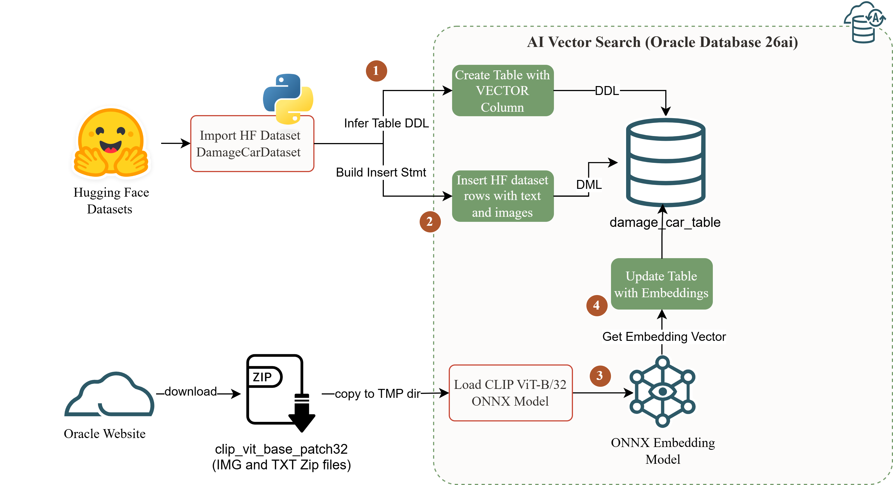
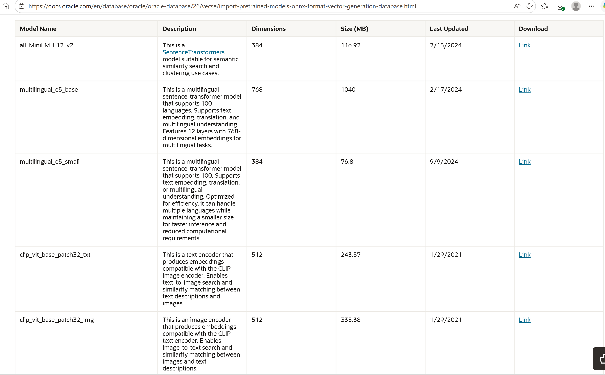

## The decision this article answers

An insurance adjuster with a new damage claim photo needs the five most visually similar settled claims from the archive, each surfacing a historical repair cost and a fraud flag from a resolved case. The retrieval must work on visual content, not metadata tags. CLIP (Contrastive Language-Image Pretraining) is the model class that makes this possible: it encodes both images and text into the same 512-dimensional vector space, enabling image-to-image similarity search and, once both encoders are loaded, text-to-image retrieval against the same stored vectors. Oracle 26ai's AI Vector Search stores and queries those vectors in SQL, with no external service dependency.

This is Part 2 of a three-part series building that system on the `tahaman/DamageCarDataset` (150 car damage images). Part 1 loaded the dataset into Oracle 26ai and established the vector schema. Part 2 covers the three steps that produce a queryable vector table: loading Oracle's pre-built CLIP ONNX encoders into the database, generating 512-dim embeddings for all 150 images with a single SQL UPDATE, and running a class clustering validation that confirms the vector space is semantically organized before any application depends on it. Part 3 runs cross-modal queries (text-to-image and image-to-image) through both encoders, with a Gradio interface.

Oracle 26ai ships two pre-built CLIP ONNX encoders callable from SQL via `VECTOR_EMBEDDING()`. The capability works. The deployment decision is which of the model's constraints are material for the specific environment: a patch-resolution ceiling that limits fine-grained visual discrimination, a language bias that degrades non-English text retrieval in ways invisible in English-only testing, and a domain boundary outside which the pre-trained model's generalization fails.

The answer requires understanding what ViT-B/32 is built on before touching the ONNX files.

---

## What CLIP ViT-B/32 is and why Oracle practitioners need to understand it before loading it

CLIP (Contrastive Language-Image Pretraining, Radford et al. 2021) was trained to place matched image-text pairs close together in a shared embedding space, and non-matching pairs far apart, across 400 million image-text pairs from the internet. Both encoders output to the same 512-dimensional space: one `VECTOR` column and a single `VECTOR_DISTANCE()` call handles image-to-image similarity and text-to-image retrieval against the same stored vectors. ([Radford et al., 2021](https://arxiv.org/abs/2103.00020) | [OpenAI CLIP](https://openai.com/index/clip/))

ViT-B/32 processes images as 32-pixel patches: a 224x224 image is divided into a 7x7 grid of 32x32-pixel tokens, and the transformer processes those 49 tokens. This produces fast, general-purpose visual similarity at the category level: damage types, object classes, visual scenes. It does not work for visual detail below the 32-pixel threshold: reading text in images, distinguishing objects that differ only in a small region, or counting repeated elements. That ceiling is architectural and predictable.

The text encoder carries a different constraint: the WIT-400M training corpus is English-dominant. Non-English text maps into the shared visual space with lower fidelity than English text. In Oracle terms: `VECTOR_EMBEDDING(CLIP_VIT_BASE_PATCH32_TXT USING 'pare-brise fissuré' AS TEXT)` produces a vector at a different position in the 512-dim space than its English equivalent, even for the same damage, because the model's learned associations are calibrated to English text-image co-occurrence. For Oracle deployments serving non-English markets, the two search paths carry different production readiness profiles.

Those properties are fixed at training time; the Oracle implementation inherits them as deployment constraints.

---

## How Oracle 26ai implements CLIP: the boundary and its rationale

The entire CLIP inference pipeline runs inside the database engine, registered as mining models and callable via `VECTOR_EMBEDDING()`. No external service, no Python inference loop, no round-trip after loading. The `.onnx` files cross the system boundary once via `docker cp`; after `LOAD_ONNX_MODEL`, Oracle owns the model.

### Architecture


*Both CLIP encoders output to the same 512-dim space and live inside Oracle after registration. The docker cp is the only external operation.*

**What this buys:** embedding generation scales with Oracle's query execution infrastructure, not with an external service's capacity or availability. The operational surface for managing a separate embedding pipeline disappears.

**Why Oracle's pre-built ONNX models are not raw model exports.** Starting with OML4Py 2.0, Oracle's OML4Py client augments pre-trained HuggingFace transformer models before exporting to ONNX: it bakes the full preprocessing and postprocessing pipeline into the ONNX graph itself. For the image encoder, that includes image resizing, pixel normalization, patch extraction, and L2 normalization of the output. For the text encoder, it includes BPE tokenization, positional encoding, and L2 normalization. The resulting ONNX file is an executable pipeline, not just model weights. Exporting CLIP directly from HuggingFace produces a graph without the preprocessing contract: the vectors compute but do not represent CLIP's semantic geometry. ([Oracle ONNX pipeline docs](https://docs.oracle.com/en/database/oracle/oracle-database/26/vecse/onnx-pipeline-models-multi-modal-embedding.html))

The `LOAD_ONNX_MODEL` METADATA JSON wires the pipeline's input nodes to Oracle's calling convention: `DATA` for the image encoder, `TEXT` for the text encoder. Both registration calls land in `user_mining_models`; both are queryable via `VECTOR_DISTANCE()` against the same 512-dim column because they were trained to produce the same geometry. Registration does not confirm the geometry is correct for the actual data: that requires generating embeddings and running a validation query.

---

## Loading both encoders: the decisions behind the steps

**Model acquisition.** Oracle's pre-built CLIP ONNX files are available for download at [Oracle CLIP documentation](https://docs.oracle.com/en/database/oracle/oracle-database/26/vecse/import-pretrained-models-onnx-format-vector-generation-database.html). Download `clip_vit_base_patch32_img.onnx.zip` and `clip_vit_base_patch32_txt.onnx.zip`, extract both `.onnx` files, then stage them inside the running container.


*Oracle doc: the source for both pre-built CLIP ONNX files. Download both `.zip` archives and extract the `.onnx` files before staging.*


```bash
docker cp clip_vit_base_patch32_img.onnx oracle-26ai-free:/tmp/
docker cp clip_vit_base_patch32_txt.onnx oracle-26ai-free:/tmp/
```


*Both files staged at `/tmp` inside `oracle-26ai-free`, the path the `ONNX_TMP` directory object points to.*

**Model registration.** Both models are registered from the `ONNX_TMP` directory object created in Part 1. The METADATA input node names `DATA` and `TEXT` are what distinguish Oracle's catalog files from generic ONNX exports of the same model.

```sql
BEGIN
  DBMS_VECTOR.LOAD_ONNX_MODEL(
    DIRECTORY  => 'ONNX_TMP',
    FILE_NAME  => 'clip_vit_base_patch32_img.onnx',
    MODEL_NAME => 'CLIP_VIT_BASE_PATCH32_IMG',
    METADATA   => JSON('{"function":"embedding","embeddingOutput":"embedding",
                         "input":{"input":["DATA"]}}'));
  DBMS_VECTOR.LOAD_ONNX_MODEL(
    DIRECTORY  => 'ONNX_TMP',
    FILE_NAME  => 'clip_vit_base_patch32_txt.onnx',
    MODEL_NAME => 'CLIP_VIT_BASE_PATCH32_TXT',
    METADATA   => JSON('{"function":"embedding","embeddingOutput":"embedding",
                         "input":{"input":["TEXT"]}}'));
END;
/
```

`ORA-40150` means a model is already registered; drop with `DBMS_VECTOR.DROP_ONNX_MODEL('MODEL_NAME', TRUE)` and re-run. Confirm both appear in `user_mining_models` before proceeding. The TXT encoder is registered here and used in Part 3. ([Oracle CLIP docs](https://docs.oracle.com/en/database/oracle/oracle-database/26/vecse/generate-multi-modal-embeddings-using-clip.html))

**Oracle-side processing.** A single `UPDATE` generates all 512-dim vectors. The verification query uses `COUNT(CASE WHEN ... IS NOT NULL THEN 1 END)`, because aggregate `COUNT` on a `VECTOR` column raises an error in Oracle 26ai.

```sql
UPDATE damage_car_table
   SET embedding = VECTOR_EMBEDDING(
         CLIP_VIT_BASE_PATCH32_IMG USING image AS DATA);
COMMIT;

SELECT COUNT(*) AS total_rows,
       COUNT(CASE WHEN embedding IS NOT NULL THEN 1 END) AS vectorized
FROM damage_car_table;
```

A gap between the two counts means `VECTOR_EMBEDDING()` silently skipped NULL BLOBs. A matching count of 150 confirms the UPDATE ran, not that the vectors are semantically correct.

**Evaluation harness.** The class clustering query below is the only reliable test of semantic organization. A correctly loaded model produces lower average distance within damage classes than across them.

```sql
SELECT t1.label AS class_a, t2.label AS class_b,
       ROUND(AVG(VECTOR_DISTANCE(t1.embedding, t2.embedding, COSINE)), 3) AS avg_dist,
       COUNT(*) AS pair_count
FROM   damage_car_table t1
JOIN   damage_car_table t2 ON t1.id < t2.id
GROUP  BY t1.label, t2.label
ORDER  BY t1.label, avg_dist;
```

The distances that query returns either confirm the model is semantically organized or expose a loading error; the next section reports which.

---

## What the data shows

Three metrics, chosen because they directly address the insurer's question: does the model separate damage categories reliably enough to surface useful historical claims?

| Metric | Definition | Why it matters here |
|---|---|---|
| Intra-class avg cosine distance | Avg `VECTOR_DISTANCE()` across all same-label image pairs | Measures whether CLIP's shared space clusters same-category damage |
| Inter-class avg cosine distance | Avg across all cross-label pairs | Measures category-level discrimination |
| Separation gap | Inter minus intra average | A gap above 0.10 supports threshold-based retrieval; below 0.05, the distributions overlap and no useful threshold exists |

### What to look for

For visually distinctive damage classes (glass shatter, tire flat), intra-class averages will fall clearly below inter-class averages. For visually variable classes (scratch under different lighting), the intra-class distribution will extend toward the inter-class range.

A gap above 0.10 between intra-class and inter-class averages confirms the model is working and supports threshold-based retrieval. A gap below 0.05 means the distributions overlap and no reliable threshold exists. Deeper retrieval testing (top-5 queries, cross-class intrusions under variable lighting, OCR probes) runs in Part 3 with the Gradio interface.

---

## What works, what fails, and the causes

**What holds reliably.** Category-level visual similarity within CLIP's training distribution. Vehicle damage (scratches, dents, broken glass, tire damage) is well-represented in WIT-400M. Category-level distance separation supports a practical threshold for claims category retrieval. For image similarity on English-language content, the image encoder is deployable.

**What requires calibration before production.** Within-class discrimination under photographic variation. Under variable lighting, intra-class distances for high-variability damage types can overlap with inter-class distances. A threshold calibrated on controlled-lighting images will produce cross-class false positives on field photos. WHEN this matters: fraud detection workflows that need to distinguish reused photos from genuinely similar incidents; any application that reads cosine distance as "same incident" rather than "same damage category." The mitigation is threshold calibration against the actual data distribution of the production archive, not the controlled-lighting test set.

**Where the architecture fails structurally.** Fine-grained detail and text in images. The 32px floor means that license plate characters, defect measurements, and object counts are lost at tokenization. The CLIP paper is explicit: "CLIP currently struggles with fine grained classification" and "counting objects." For insurance: the image encoder is not usable for matching damage by severity, reading VINs from photos, or distinguishing two dents from three on the same panel. These are hard architectural limits, not tuning opportunities.

**The language constraint that does not appear in English-only testing.** CLIP's text encoder was trained on WIT-400M, which is English-dominant. Non-English text is expected to embed with lower fidelity than English, because the model's learned associations are calibrated to English text-image co-occurrence. Activating `CLIP_VIT_BASE_PATCH32_TXT` in non-English deployments without language validation carries production risk; the validation protocol runs in Part 3. WHEN this matters: any Oracle deployment where `CLIP_VIT_BASE_PATCH32_TXT` will be queried in a language other than English: the degradation is structural, not configurable.

**Limitations of this experiment.** The 150-row dataset produces clear patterns but does not validate production-scale HNSW index behavior. French encoder quality is asserted from training data analysis; direct measurement runs in Part 3. Cross-domain transfer (how this model performs outside the automotive and consumer visual domain) is not tested.

---

## The recommendation

Start with Oracle's pre-built CLIP encoders for image similarity PoC work when the visual domain falls within general internet imagery and the primary query language is English. Run the class clustering harness before any downstream application consumes the vectors. Calibrate the similarity threshold against the actual data distribution of the production archive before activating a retrieval filter. Run language validation before activating the TXT encoder in non-English deployments; the protocol runs in Part 3.

For the insurer: the image encoder is production-ready for the claims photo similarity use case based on the class separation gap and the in-database architecture.

Oracle's pre-built CLIP encoders are the right starting point for multi-modal search on general visual content. Knowing which limits are material for the specific deployment is what converts a PoC into a production system.

---

## Decision guide for Oracle teams

The constraints above translate into conditional deployment paths based on visual domain, query language, scale, and discrimination requirements.

| Your situation | Recommended path | When to re-evaluate |
|---|---|---|
| Image similarity PoC, general visual domain | Deploy Oracle catalog image encoder; run clustering harness before downstream use | When domain shifts to specialized imagery outside internet-scale training distribution |
| Cross-modal retrieval, English text queries | Load both encoders; validate clustering; use TXT encoder in Part 3 queries | When query language expands beyond English |
| Non-English text queries in production | Run top-5 overlap test: target language vs. English against same image set | Switch to a multilingual CLIP variant if top-5 overlap falls significantly below the English baseline |
| Fine-grained discrimination required (severity, text in image, object count) | Test on labeled examples; expect degraded precision at sub-32px detail | Consider ViT-B/16 or a task-specific model if precision falls below requirement |
| Production scale beyond 100K rows | Same model; add HNSW vector index before querying | Benchmark latency at indexed scale before go-live |

**Validate before production:**

1. Run the class clustering query; require a separation gap above 0.10 before trusting any similarity result
2. Run top-5 retrieval for one reference image per class; verify same-class majority in the top 3 results
3. Calibrate the similarity threshold against the actual production data distribution, not the test set
4. For fine-grained use cases: test explicitly against examples where precision at sub-patch detail matters

---

## Final take

The insurer's claims similarity system has a deployable foundation: the image encoder produces reliable category-level grouping, confirmed by the class clustering harness.

The non-negotiable step before production is running the clustering harness and calibrating the similarity threshold against the actual production archive before any application depends on the vectors.

> **Oracle's pre-built CLIP encoders are production-ready for general visual similarity on English-language data. The deployment decision is not whether to use them: it is which of their documented limits are material for the specific domain and language of the operational environment.**

---

## References

- Radford et al. (2021). *Learning Transferable Visual Models From Natural Language Supervision.* [arxiv.org/abs/2103.00020](https://arxiv.org/abs/2103.00020)
- OpenAI. *CLIP: Connecting text and images.* [openai.com/index/clip/](https://openai.com/index/clip/)
- Oracle. *ONNX Pipeline Models for Multi-Modal Embedding.* [docs.oracle.com](https://docs.oracle.com/en/database/oracle/oracle-database/26/vecse/onnx-pipeline-models-multi-modal-embedding.html)
- Oracle. *Generate Multi-Modal Embeddings Using CLIP.* [docs.oracle.com](https://docs.oracle.com/en/database/oracle/oracle-database/26/vecse/generate-multi-modal-embeddings-using-clip.html)
- Oracle. *Convert Pretrained Models to ONNX Model: End-to-End Instructions for Text Embedding.* [docs.oracle.com](https://docs.oracle.com/en/database/oracle/oracle-database/26/vecse/convert-pretrained-models-onnx-model-end-end-instructions.html)

---

## Related assets

| Asset | Link |
|---|---|
| GitHub repo (full code) | [assoudi-typica-ai/pre-built-multi-modal-clip-embedding-series](https://github.com/assoudi-typica-ai/pre-built-multi-modal-clip-embedding-series) |
| Series Part 1 | [HuggingFace Datasets in Oracle 26ai: Jump-Starting CLIP Vector Search Experiments](https://assoudi.blog/posts/huggingface-datasets-oracle-26ai-clip-vector-search/) |
| Series post #0 | [Building a Local Oracle 26ai Free Lab with Docker](https://assoudi.blog/posts/building-local-oracle-database-26ai-free-lab/) |

---

## Next in this series

Both encoders are registered. The image embedding space is populated and validated. Part 3 queries both encoders together: a text description generates a vector via `CLIP_VIT_BASE_PATCH32_TXT`, compared against the image embeddings in `damage_car_table` with `VECTOR_DISTANCE(COSINE)`. That cross-modal query, the language validation protocol, and the Gradio interface that wraps both search paths, is where the insurer scenario completes.

