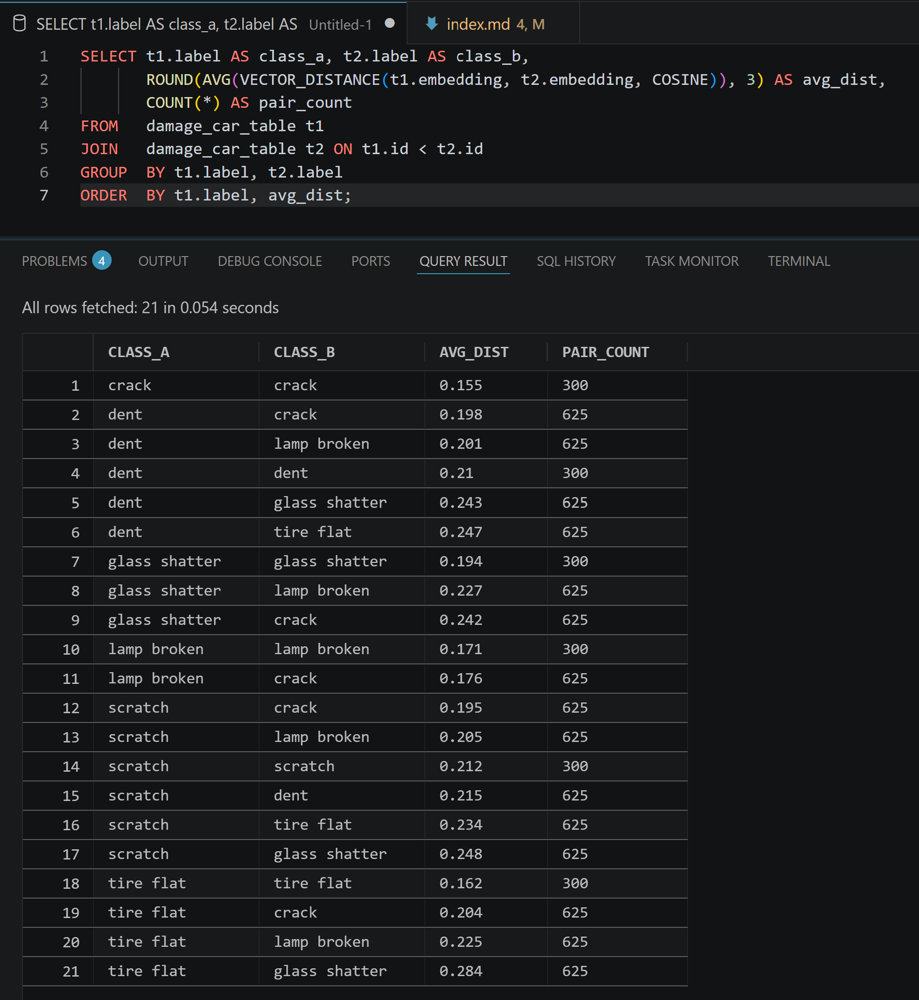

## What this article builds

Oracle 26ai can be used as a compact environment for experimenting with multimodal visual similarity search.

In this article, I show how to build that pipeline end to end: load a real image/text dataset, register Oracle’s pre-built CLIP ViT-B/32 ONNX models, generate image embeddings inside the database, store them in VECTOR columns, and query them with SQL.

The running use case is insurance claims similarity. Given a new car damage photo, the system should retrieve visually similar historical claims from the archive. The point is not to build a full claims application yet. The point is to validate whether Oracle 26ai can act as the execution, storage, and search layer for this kind of multimodal AI workflow.

Part 1 loaded the HuggingFace `tahaman/DamageCarDataset` into Oracle 26ai. Part 2 loads the CLIP ONNX encoders, generates image embeddings, stores them in VECTOR columns, and validates whether the embedding space is useful enough for similarity search. Part 3 will add cross-modal text-to-image queries and the Gradio interface.

---

## What CLIP ViT-B/32 is and why Oracle practitioners need to understand it before loading it

CLIP (Contrastive Language-Image Pretraining, Radford et al. 2021) was trained to place matched image-text pairs close together in a shared embedding space, and non-matching pairs far apart, across 400 million image-text pairs from the internet. Both encoders output to the same 512-dimensional space: one `VECTOR` column and a single `VECTOR_DISTANCE()` call handles image-to-image similarity and text-to-image retrieval against the same stored vectors. ([Radford et al., 2021](https://arxiv.org/abs/2103.00020) | [OpenAI CLIP](https://openai.com/index/clip/))

ViT-B/32 processes images as 32-pixel patches: a 224x224 image is divided into a 7x7 grid of 32x32-pixel tokens, and the transformer processes those 49 tokens. This produces fast, general-purpose visual similarity at the category level: damage types, object classes, visual scenes. It does not work for visual detail below the 32-pixel threshold: reading text in images, distinguishing objects that differ only in a small region, or counting repeated elements. That ceiling is architectural and predictable.

The text encoder carries a different constraint: the WIT-400M training corpus is English-dominant. Non-English text maps into the shared visual space with lower fidelity than English text. In Oracle terms: `VECTOR_EMBEDDING(CLIP_VIT_BASE_PATCH32_TXT USING 'pare-brise fissuré' AS TEXT)` produces a vector at a different position in the 512-dim space than its English equivalent, even for the same damage, because the model's learned associations are calibrated to English text-image co-occurrence. For Oracle deployments serving non-English markets, the two search paths carry different production readiness profiles.

Those properties are fixed at training time; the Oracle implementation inherits them as deployment constraints.

---

## The Oracle 26ai multimodal pipeline

The pipeline has five steps: import the real dataset, create the VECTOR-enabled table, load the CLIP ONNX model, generate embeddings in-database, and run SQL similarity search.

### Architecture


*Both CLIP encoders output to the same 512-dim space and live inside Oracle after registration. After the dataset and ONNX files are staged, embedding generation, storage, and similarity search run inside the database.*

**What this buys:** embedding generation becomes part of the database execution path instead of a separate service call. For a prototype or controlled experiment, the operational surface is smaller: no external vector database, no separate embedding API, and no additional orchestration layer just to test visual similarity.

**Why Oracle's pre-built ONNX models are not raw model exports.** Starting with OML4Py 2.0, Oracle's OML4Py client augments pre-trained HuggingFace transformer models before exporting to ONNX: it bakes the full preprocessing and postprocessing pipeline into the ONNX graph itself. For the image encoder, that includes image resizing, pixel normalization, patch extraction, and L2 normalization of the output. For the text encoder, it includes BPE tokenization, positional encoding, and L2 normalization. The resulting ONNX file is an executable pipeline, not just model weights. Exporting CLIP directly from HuggingFace produces a graph without the preprocessing contract: the vectors compute but do not represent CLIP's semantic geometry. ([Oracle ONNX pipeline docs](https://docs.oracle.com/en/database/oracle/oracle-database/26/vecse/onnx-pipeline-models-multi-modal-embedding.html))

The `LOAD_ONNX_MODEL` METADATA JSON wires the pipeline's input nodes to Oracle's calling convention: `DATA` for the image encoder, `TEXT` for the text encoder. Both registration calls land in `user_mining_models`; both are queryable via `VECTOR_DISTANCE()` against the same 512-dim column because they were trained to produce the same geometry. Registration does not confirm the geometry is correct for the actual data: that requires generating embeddings and running a validation query.

---

## Loading both encoders: the decisions behind the steps

**Model acquisition.** Oracle's pre-built CLIP ONNX files are available for download at [Oracle CLIP documentation](https://docs.oracle.com/en/database/oracle/oracle-database/26/vecse/import-pretrained-models-onnx-format-vector-generation-database.html). Download `clip_vit_base_patch32_img.onnx.zip` and `clip_vit_base_patch32_txt.onnx.zip`, extract both `.onnx` files, then stage them inside the running container.


*Oracle doc: the source for both pre-built CLIP ONNX files. Download both `.zip` archives and extract the `.onnx` files before staging.*


```bash
docker cp clip_vit_base_patch32_img.onnx oracle-26ai-free:/tmp/
docker cp clip_vit_base_patch32_txt.onnx oracle-26ai-free:/tmp/
```


*Both files staged at `/tmp` inside `oracle-26ai-free`, the path the `ONNX_TMP` directory object points to.*

**Model registration.** Both models are registered from the `ONNX_TMP` directory object created in Part 1. The METADATA input node names `DATA` and `TEXT` are what distinguish Oracle's catalog files from generic ONNX exports of the same model.

```sql
BEGIN
  DBMS_VECTOR.LOAD_ONNX_MODEL(
    DIRECTORY  => 'ONNX_TMP',
    FILE_NAME  => 'clip_vit_base_patch32_img.onnx',
    MODEL_NAME => 'CLIP_VIT_BASE_PATCH32_IMG',
    METADATA   => JSON('{"function":"embedding","embeddingOutput":"embedding",
                         "input":{"input":["DATA"]}}'));
  DBMS_VECTOR.LOAD_ONNX_MODEL(
    DIRECTORY  => 'ONNX_TMP',
    FILE_NAME  => 'clip_vit_base_patch32_txt.onnx',
    MODEL_NAME => 'CLIP_VIT_BASE_PATCH32_TXT',
    METADATA   => JSON('{"function":"embedding","embeddingOutput":"embedding",
                         "input":{"input":["TEXT"]}}'));
END;
/
```

`ORA-40150` means a model is already registered; drop with `DBMS_VECTOR.DROP_ONNX_MODEL('MODEL_NAME', TRUE)` and re-run. Confirm both appear in `user_mining_models` before proceeding. The TXT encoder is registered here and used in Part 3. ([Oracle CLIP docs](https://docs.oracle.com/en/database/oracle/oracle-database/26/vecse/generate-multi-modal-embeddings-using-clip.html))

**Oracle-side processing.** A single `UPDATE` generates all 512-dim vectors. The verification query uses `COUNT(CASE WHEN ... IS NOT NULL THEN 1 END)`, because aggregate `COUNT` on a `VECTOR` column raises an error in Oracle 26ai.

```sql
UPDATE damage_car_table
   SET embedding = VECTOR_EMBEDDING(
         CLIP_VIT_BASE_PATCH32_IMG USING image AS DATA);
COMMIT;

SELECT COUNT(*) AS total_rows,
       COUNT(CASE WHEN embedding IS NOT NULL THEN 1 END) AS vectorized
FROM damage_car_table;
```

A gap between the two counts means `VECTOR_EMBEDDING()` silently skipped NULL BLOBs. A matching count of 150 confirms the UPDATE ran, not that the vectors are semantically correct.

**Evaluation harness.** The class clustering query below is the first useful test of semantic organization.

```sql
SELECT t1.label AS class_a, t2.label AS class_b,
       ROUND(AVG(VECTOR_DISTANCE(t1.embedding, t2.embedding, COSINE)), 3) AS avg_dist,
       COUNT(*) AS pair_count
FROM   damage_car_table t1
JOIN   damage_car_table t2 ON t1.id < t2.id
GROUP  BY t1.label, t2.label
ORDER  BY t1.label, avg_dist;
```

The distances that query returns either confirm the model is semantically organized or expose a loading error; the next section reports which.

---

## What the data shows

Three metrics, chosen because they directly address the insurer's question: does the model separate damage categories reliably enough to surface useful historical claims?

| Metric | Definition | Why it matters here |
|---|---|---|
| Intra-class avg cosine distance | Avg `VECTOR_DISTANCE()` across all same-label image pairs | Measures whether CLIP's shared space clusters same-category damage |
| Inter-class avg cosine distance | Avg across all cross-label pairs | Measures category-level discrimination |
| Separation gap | Inter minus intra average | A gap above 0.10 supports threshold-based retrieval; below 0.05, the distributions overlap and no useful threshold exists |

### Result from this dataset

On the `tahaman/DamageCarDataset` sample used in this series, the class clustering harness produced a separation gap of **0.24** between average inter-class and intra-class cosine distance.

That result is strong enough for category-level visual similarity experimentation. It means the embedding space is not random: same-category damage images are, on average, closer to each other than to images from other damage categories.

It does not mean the model is ready for every insurance workflow. It supports claims-category retrieval experiments. It does not, by itself, validate same-incident detection, damage severity estimation, license plate reading, or production-scale search behavior.

### What the result shows

The class clustering harness produced an average intra-class cosine distance of **0.184** and an average inter-class cosine distance of **0.223**. The resulting average separation gap is **0.039**.

That means the model is not randomly organizing the images: same-label pairs are closer on average than cross-label pairs. However, the margin is narrow. It does not support a production-style global threshold for category retrieval.

The more useful interpretation is class-specific. `crack` and `tire flat` show strong internal clustering, with intra-class averages of **0.155** and **0.162**. `dent` and `scratch` are weaker, with intra-class averages of **0.210** and **0.212**, which overlap with several cross-class distances.

This is exactly the kind of result Oracle practitioners should look for before building downstream logic on top of vector search. The embedding pipeline works, but the similarity score still needs retrieval testing, class-specific analysis, and threshold calibration against the real archive.


| Result | Value | Interpretation |
|---|---:|---|
| Average intra-class distance | 0.184 | Same-label images are moderately close |
| Average inter-class distance | 0.223 | Cross-label images are farther on average |
| Average separation gap | 0.039 | Useful signal, but not enough for a global threshold |
| Best internal clusters | crack, tire flat | Stronger class-level grouping |
| Weakest internal clusters | dent, scratch | Higher overlap risk |



*Class-pair cosine distances returned by the validation query. The result confirms useful visual structure, but also shows overlap between some same-class and cross-class distances.*

---

### What this result means

On this dataset, the model creates a usable visual neighborhood, but not a clean decision boundary. Same-label damage images are closer on average than different-label images. This makes the model useful for candidate retrieval.

It can help surface visually similar claims for inspection, comparison, triage, or analyst review. It should not be treated as a standalone classifier, duplicate detector, severity estimator, or automated claims decision engine.

The value of Oracle's shipped CLIP model is that it gives you a fast path to build a realistic multimodal experiment inside the database. The limitation is that the model still has to prove, on your data, whether its nearest neighbors are useful for your business workflow (using top-k retrieval).

---

## Practical recommendation

Start with Oracle's pre-built CLIP image encoder when your goal is to prototype visual similarity on general image content.

Use it first as a retrieval layer: given a new image, return the closest candidates from the archive and inspect the results. 

For a stronger quantitative validation, use the dataset split explicitly and calculate retrieval metrics such as top-1 accuracy, recall@k, mean reciprocal rank, or mean average precision.

Part 3 will add the Gradio interface so the retrieved results can be inspected visually, including cross-modal text-to-image queries using the text encoder.

---

## Final take

Oracle's pre-built CLIP ViT-B/32 image encoder is a strong accelerator for multimodal experimentation inside Oracle 26ai.

It lets Oracle practitioners move quickly from real image data to in-database vector search using BLOB storage, ONNX inference, `VECTOR` columns, and SQL.

But the model should be understood as a starting point for visual retrieval, not as a finished decision model.

On this dataset, the nearest-neighbor space is useful, but not sharply separated. That means the best first use case is candidate discovery: retrieve similar claims, inspect them, and then decide whether the retrieval quality is good enough for the workflow.

Oracle 26ai can host the full experiment, but the quality of the similarity behavior still has to be validated against the application you want to build.

> Oracle's pre-built CLIP encoders are a strong starting point for multimodal visual similarity experiments inside Oracle 26ai. The deployment decision is whether the resulting embedding space is good enough for the domain, scale, and business decision the application must support.
---

## References

- Radford et al. (2021). *Learning Transferable Visual Models From Natural Language Supervision.* [arxiv.org/abs/2103.00020](https://arxiv.org/abs/2103.00020)
- OpenAI. *CLIP: Connecting text and images.* [openai.com/index/clip/](https://openai.com/index/clip/)
- Oracle. *ONNX Pipeline Models for Multi-Modal Embedding.* [docs.oracle.com](https://docs.oracle.com/en/database/oracle/oracle-database/26/vecse/onnx-pipeline-models-multi-modal-embedding.html)
- Oracle. *Generate Multi-Modal Embeddings Using CLIP.* [docs.oracle.com](https://docs.oracle.com/en/database/oracle/oracle-database/26/vecse/generate-multi-modal-embeddings-using-clip.html)
- Oracle. *Convert Pretrained Models to ONNX Model: End-to-End Instructions for Text Embedding.* [docs.oracle.com](https://docs.oracle.com/en/database/oracle/oracle-database/26/vecse/convert-pretrained-models-onnx-model-end-end-instructions.html)

---

## Related assets

| Asset | Link |
|---|---|
| GitHub repo (full code) | [assoudi-typica-ai/pre-built-multi-modal-clip-embedding-series](https://github.com/assoudi-typica-ai/pre-built-multi-modal-clip-embedding-series) |
| Series Part 1 | [HuggingFace Datasets in Oracle 26ai: Jump-Starting CLIP Vector Search Experiments](https://assoudi.blog/posts/huggingface-datasets-oracle-26ai-clip-vector-search/) |
| Series post #0 | [Building a Local Oracle 26ai Free Lab with Docker](https://assoudi.blog/posts/building-local-oracle-database-26ai-free-lab/) |

---

## Next in this series

Both encoders are registered. The image embedding space is populated and validated. Part 3 queries both encoders together: a text description generates a vector via `CLIP_VIT_BASE_PATCH32_TXT`, compared against the image embeddings in `damage_car_table` with `VECTOR_DISTANCE(COSINE)`. That cross-modal query, the language validation protocol, and the Gradio interface that wraps both search paths, is where the insurer scenario completes.

