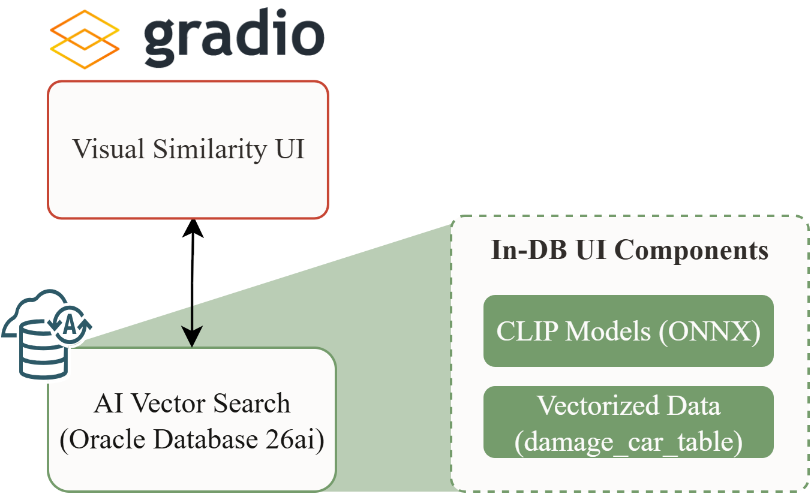
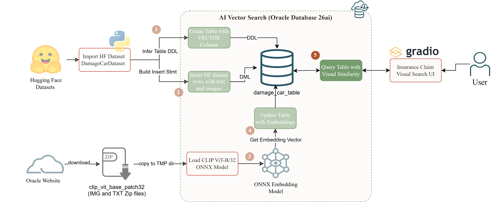
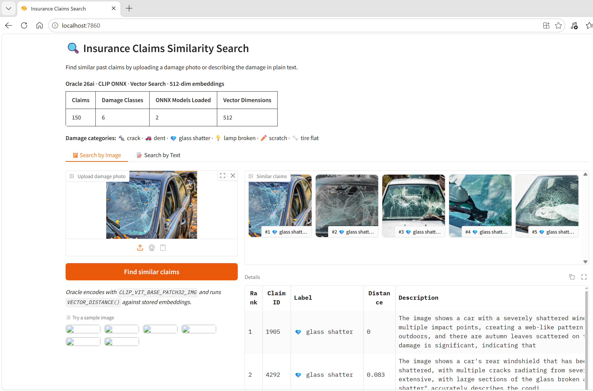

## Three parts, one PoC

The split across this series reflects a methodological decision, not a length constraint.

Part 1 removed data friction: a labeled image dataset from HuggingFace imports into Oracle 26ai in a single Python script, schema inferred automatically from the dataset card, ready for vector search without manual DDL. Part 2 removed model friction: both CLIP ONNX encoders register via `DBMS_VECTOR.LOAD_ONNX_MODEL`, embeddings generate with one SQL UPDATE, and a class-pair distance harness confirms the vector space is semantically organized before anything depends on it. Part 3 removes the validation friction: making retrieval results inspectable by the people whose domain knowledge determines whether the PoC is ready to move forward.

The split between Parts 2 and 3 is the most important one. Both parts validate the model, but they validate different things. Part 2's class-pair distance harness answers one question: is the geometry correct? Part 3's Gradio session answers the harder one: is the geometry useful for the specific query types, languages, and visual categories this deployment will actually see? The first question has a correct answer. The second requires human judgment and targeted edge-case testing.


*Part 3's runtime architecture: Gradio sends a query, Oracle runs VECTOR_EMBEDDING() and VECTOR_DISTANCE(), ranked results come back. All model inference stays inside the database.*

---

## The problem this solves

Part 2 closed with a number: the class-pair cosine distance matrix confirmed that `CLIP_VIT_BASE_PATCH32_IMG` produces semantically organized vectors. Same-class image pairs clustered clearly below cross-class pairs. The gap confirmed the geometry.

That number does not answer whether the results are useful. An insurance adjuster evaluating a similarity search tool needs to look at the returned images, not at cosine averages. A tool that returns five images at distance 0.25, all from the wrong damage category, is not ready for production regardless of what the distance matrix says.

Part 2 also flagged two constraints without measuring them: the language degradation in `CLIP_VIT_BASE_PATCH32_TXT` on non-English text, and the visual ambiguity between the `dent`, `crack`, and `scratch` damage classes. SQL aggregation can locate them as geometric phenomena. A Gradio UI can show what they look like in practice.

> **SQL confirms geometry. The Gradio UI confirms meaning. Both checks are required before a PoC is ready for domain expert review.**

---

## Who this is for

This post is for **Oracle developers and architects** who:

- Completed Parts 1 and 2: `damage_car_table` holds 150 rows, both CLIP ONNX encoders are registered, and the `embedding` column is fully populated with 512-dim image vectors
- Need to evaluate retrieval quality interactively before deciding whether to connect a downstream workflow or present to a domain reviewer
- Are building toward non-English query support and need a concrete measurement of the degradation before committing to the architecture

It is **not** for teams that need precision@K or mean average precision metrics from a labeled test set. The Gradio validation in this post is qualitative: structured human inspection of top-K results. Quantitative benchmarking against a held-out evaluation set is a separate step.

---

## The approach

The Gradio app is a thin SQL client. It converts an uploaded image to JPEG bytes or takes a text string, passes either to the corresponding VECTOR_EMBEDDING() call inside Oracle, and renders the ranked rows that come back. The Python process carries no model weights, no ONNX runtime, no GPU dependency.

### Architecture


*The complete series flow. Data lands in Oracle in Part 1. Models load and embeddings generate in Part 2. The Gradio UI in Part 3 is the validation layer: the user sees results, Oracle runs all inference.*

**What lives inside Oracle after Part 2:**
- `CLIP_VIT_BASE_PATCH32_IMG`: image encoder, registered in Part 2
- `CLIP_VIT_BASE_PATCH32_TXT`: text encoder, registered in Part 2
- 150 x 512-dim FLOAT32 vectors in `damage_car_table.embedding`

**What the Gradio app adds:**
- An image upload input and a text input, each wired to one SQL query
- A gallery component and a dataframe component as the result display
- No new model loading, no schema changes, no data migration

**The key constraint:** the app connects to `demo_vec@localhost:1521/FREEPDB1` at startup. If the Oracle container is not running, the failure is immediate, not deferred to query time.

---

## Why Gradio for this series

The Oracle 26ai embedding search pattern is consistent across every experiment in this series: a query input is converted to a vector by VECTOR_EMBEDDING(), compared against stored vectors by VECTOR_DISTANCE(), and ranked results come back as rows. Gradio's reactive model maps directly to this: an input widget triggers a Python function that executes SQL, and the return value updates the output widgets.

For this dataset, the two search functions are structurally identical. The only differences are the model name and the bind variable type. That symmetry is visible in the code and reinforced by the UI layout.

**No inference in Python.** `clip_demo_gradio.py` imports `oracledb`, `gradio`, and `pillow`. It does not import `torch`, `onnxruntime`, or `transformers`. The Python process is a renderer and a SQL client. Keeping all inference inside Oracle is the architectural decision from Part 2; the Gradio file enforces it at the dependency level.

**Gallery and Dataframe fit image retrieval.** A `gr.Gallery` displays the ranked result images with per-image captions. A `gr.Dataframe` below it shows claim ID, damage class, cosine distance, and description text for each result. For validating whether the search is returning the right images, this layout gives the reviewer everything needed in one screen: images to judge visually and metadata to cross-reference.

**Built-in Examples for structured testing.** Gradio's `gr.Examples` component pre-loads a set of representative queries that a reviewer can click to run. The example set covers the English cases that work well, the English cases that mix classes, and the French cases where the model fails. A reviewer with no SQL knowledge can run the full validation session in ten minutes.

**Reusable structure for the rest of this series.** This series covers loading different ONNX models into Oracle and querying with VECTOR_DISTANCE. The structure of `clip_demo_gradio.py` is the template: one search function per query type, one Gallery and one Dataframe per tab, one SQL constant per encoder. For future experiments, swapping the model name and the SQL query is all that changes.

---

## Prerequisites

| Requirement | Details |
|---|---|
| Oracle version | Oracle Database 26ai Free, running in Docker |
| Prerequisite | Parts 1 and 2 complete: `damage_car_table` populated, both CLIP encoders registered, `embedding` column fully populated |
| Python | 3.10+, with `oracledb`, `gradio`, `pillow` (pinned versions in `requirements.txt`) |
| Estimated time | 10 minutes setup, 30 minutes for a thorough validation pass |

**Assumed knowledge:** Parts 1 and 2 completed. Docker container `oracle-26ai-free` running. `demo_vec@FREEPDB1` reachable at `localhost:1521`.

---

## Step-by-step

> Full code: `clip_demo_gradio.py` in the GitHub repo  
> This section covers the key patterns and validation runs. Not every line.

| Step | What it covers | Time |
|---|---|---|
| 1 | Install dependencies and launch | 2 min |
| 2 | Key code patterns in `clip_demo_gradio.py` | 5 min |
| 3 | Structured qualitative validation runs | 20-30 min |

---

### Step 1: Install and launch

```bash
pip install oracledb gradio pillow
python clip_demo_gradio.py
```

The app connects to Oracle at startup, queries the model catalog and row count, and opens at `http://localhost:7860`. A header showing total claims, damage classes, ONNX models loaded, and vector dimensions confirms the Oracle connection is live before the first search runs.

**What can go wrong here:** On Windows, `oracledb` in thick mode requires Oracle Instant Client on the PATH. The app works in thin mode without Instant Client; remove any `oracledb.init_oracle_client()` call if thick mode is not needed.

---

### Step 2: Key code patterns

The two SQL queries are the core of the app. They differ only in model name and bind variable name:

```python
_IMG_SQL = """
    SELECT image_id, label, description, image,
           ROUND(VECTOR_DISTANCE(embedding,
                 VECTOR_EMBEDDING(CLIP_VIT_BASE_PATCH32_IMG USING :img AS DATA),
                 COSINE), 3) AS dist
    FROM damage_car_table ORDER BY dist FETCH FIRST :top_k ROWS ONLY
"""
_TXT_SQL = """  -- identical, with CLIP_VIT_BASE_PATCH32_TXT USING :txt AS DATA
"""
```

The two search functions follow the same structure. The image function converts the PIL upload to JPEG bytes and sets the BLOB input size; the text function passes the string directly:

```python
def search_by_image(pil_img):
    buf = io.BytesIO()
    pil_img.save(buf, format="JPEG")
    rows = _run_query(_IMG_SQL, {"img": buf.getvalue(), "top_k": TOP_K},
                      input_sizes={"img": oracledb.DB_TYPE_BLOB})
    return _rows_to_gradio(rows)

def search_by_text(query_text):
    rows = _run_query(_TXT_SQL, {"txt": query_text.strip(), "top_k": TOP_K})
    return _rows_to_gradio(rows)
```

The helper `_rows_to_gradio` reads each Oracle BLOB into a PIL Image and builds a caption string. It returns a tuple of (gallery items, dataframe rows) because the Gradio button is wired to two output components:

```python
img_btn.click(fn=search_by_image,
              inputs=img_input,
              outputs=[img_gallery, img_df])
```

**What can go wrong here:** Oracle LOB objects from `oracledb` are not file-like. Pass the result through `.read()` before opening with PIL: `Image.open(io.BytesIO(blob.read()))`. Passing the raw LOB object raises a `TypeError` inside PIL that is not immediately obvious.

---

### Step 3: Qualitative validation runs

The queries below were run directly against Oracle before writing this post. The results here are not illustrative; they are the actual output.

**Image queries, distinctive classes.** Upload `test_tire_flat_id51.jpg`. All 5 results are labeled `tire flat`, distances 0.064 to 0.087. Upload `test_glass_shatter_id76.jpg`. All 5 results are `glass shatter`, distances 0.083 to 0.113. Visually distinctive classes retrieve cleanly.


*Glass shatter image search: the query image is in the table (distance 0, rank 1), and the next four results are all glass shatter with distances 0.083 to 0.113. Five of five correct.*

**Image queries, ambiguous classes.** Upload `test_dent_id26.jpg`. The top result is the same image (distance 0, the query image is in the table). Results 2 through 5: crack (0.104), lamp broken (0.105), crack (0.111), scratch (0.118). One of the five is a dent. The visual overlap between the dent class and crack, lamp broken, and scratch is real in this dataset.

**Text queries, English.** Type `flat tire on the road`: all 5 results are `tire flat`, distances 0.689 to 0.706. Type `cracked windshield`: 4 of 5 are `glass shatter`, distances 0.692 to 0.708. Type `broken headlight`: 3 of 5 are `lamp broken`, distances 0.688 to 0.702. Type `dent on rear bumper`: 3 of 5 are `crack`, 1 is `scratch`, 1 is `dent`.

**Text queries, French.** Type `pare-brise fissuré` (French for "cracked windshield"): 4 of 5 results are `scratch`, distances 0.760 to 0.776. Zero glass shatter results appear. Type `phare cassé` (broken headlight): top 5 results are dent (0.776), scratch (0.781), scratch (0.785), scratch (0.791), scratch (0.796). Zero lamp broken results appear.

---

## What I observed

**Tire flat is reliable in both modalities; dent is not reliable in either.** Image queries for tire flat return 5/5 correct results with distances 0 to 0.087. Image queries for dent return 1/5 correct results in the top 5. Text queries follow the same pattern: `flat tire on the road` returns 5/5 tire flat; `dent on rear bumper` returns a majority of crack and scratch images. This is not a model failure; it is a dataset and visual category property. Tire damage has a distinctive geometric signature that CLIP's 32-pixel patch encoding captures reliably. Dent, crack, and scratch overlap heavily under variable lighting and camera angle. The Gradio UI makes this concrete in one comparison: upload a tire flat image and a dent image, observe the results side by side.

**French queries degrade measurably and the degradation is not uniform.** The class-level aggregation for `pare-brise fissuré` ranks `scratch` as the closest class (avg dist 0.798) and `glass shatter` fourth (0.806). For the English equivalent, `glass shatter` ranks first at 0.725, with the next class 0.033 away. The French query inverted the correct answer completely. By contrast, `pneu crevé` (flat tire) returns tire flat images in 4 of 5 top results, because the visual signature is strong enough to survive the degraded text encoding. The degradation is not a uniform penalty across all classes: visually distinctive categories recover partially; semantically specific categories do not. For Oracle deployments where text queries will arrive in French or another non-English language, this is not a tuning problem. The encoder was trained on English-dominant data. The limitation is structural.

**The distance scale does not transfer across modalities.** Same-modal image queries return distances between 0.064 and 0.113 for correct class retrieval. Cross-modal text queries return distances between 0.688 and 0.708 for the same classes. A threshold calibrated for image queries would reject nearly every text query result. Any downstream logic that uses a fixed similarity threshold needs separate calibration per query type. Relative ranking within a single query is meaningful; the absolute value across image and text queries is not comparable.

**CLIP has no out-of-domain rejection.** Querying `orange fruit` returns dent and scratch images at distances 0.753 to 0.808. Querying `parking ticket` returns scratch and lamp broken images at distances 0.737 to 0.745. The model always returns the K nearest vectors regardless of whether the query belongs to the domain. Out-of-domain queries produce consistently higher distances (above 0.75) compared to well-matched English queries (0.688 to 0.71), which provides a weak signal. A confidence band with a distance cutoff above 0.74 would suppress most out-of-domain results, but calibrating that cutoff requires running out-of-domain queries explicitly and inspecting the boundary, which is exactly what the Gradio UI enables.

---

## Limits and trade-offs

| Dimension | This approach | Alternative |
|---|---|---|
| Validation depth | Qualitative: structured human inspection of top-K results | Quantitative: labeled test set, precision@K, mean average precision |
| Language coverage | English: strong retrieval. French and other languages: class-specific degradation measured in this post | Multilingual CLIP variants (e.g., mCLIP) or dedicated multilingual embedding models |
| Out-of-domain handling | No rejection: always returns K results; distance signal is weak but present | Distance threshold with calibrated cutoff per query modality |
| Scale | Linear scan at 150 rows: suitable for PoC validation | HNSW vector index before querying at production scale |
| Inference location | Oracle: no GPU, no Python model weights | Python ONNX Runtime for offline profiling or latency benchmarking |

**What this approach does not replace:**
- A labeled evaluation set and precision@K metrics for go/no-go production decisions
- Language validation for non-English production deployments (this post measures the gap; it does not close it)
- A distance-calibration pass before activating any threshold-based downstream logic

---

## When to use this, and when not to

| Your situation | Use Gradio validation? | Why |
|---|---|---|
| PoC on image retrieval, evaluating quality interactively before connecting downstream workflow | Yes | Renders returned images for human review without requiring SQL access |
| Non-English text queries are part of the use case | Yes, specifically for this | The UI surfaces language degradation in one query where SQL averages obscure it |
| Domain experts need to validate before sign-off | Yes | Non-technical reviewers can assess results at localhost:7860 without touching SQL |
| You need precision@K or MAP metrics for a formal evaluation | No | Use a labeled test set and a metrics library; Gradio is for inspection, not benchmarking |
| Production UI for end users | No | No authentication, no rate limiting, no connection pooling; this is an inspection prototype |

---

## Final take

The three-session PoC this series describes does not end at "vectors are generated and distances look reasonable." It ends at "a domain expert has run structured queries including edge cases and confirmed the results match operational expectations." The Gradio prototype is what makes that last session possible without requiring SQL access or distance score interpretation.

What the validation session in this post surfaced: CLIP handles visually distinctive English-language queries reliably at the category level. It does not handle the `dent` class reliably in text. It fails the French equivalent of its strongest English queries. It has no mechanism to decline out-of-domain inputs. None of those findings required a labeled test set or a metrics library. All of them required looking at the images the model actually returned.

For Oracle teams evaluating pre-built ONNX encoders: build the thin SQL client first. The SQL confirms the model is loaded correctly. The UI confirms what you are actually deploying.

> **Distance scores tell you where vectors land. The Gradio UI tells you whether those locations are useful.**

---

## Related assets

| Asset | Link |
|---|---|
| `clip_demo_gradio.py` | Gradio app: image and text search against Oracle 26ai |
| `clip_demo_multimodal.sql` | Text encoder registration and cross-modal validation queries |
| `clip_demo_vectorize.sql` | Image encoder registration and bulk embedding UPDATE (Part 2) |
| `clip_demo_setup.sql` | DB user creation and ONNX directory object (Part 1) |
| `clip_demo_import_dataset.py` | HuggingFace dataset import (Part 1) |
| Oracle ML AI Models catalog | [OCI Object Storage model catalog](https://adwc4pm.objectstorage.us-ashburn-1.oci.customer-oci.com/p/fU1V-voY2VBhhqMPjhCC57Up77ROK9u6GN_j3-uGi_EzIdHm9XDn-RfnZS5bV0cN/n/adwc4pm/b/OML-ai-models/o/Oracle%20Machine%20Learning%20AI%20models.htm) |
| Series Part 2 | [CLIP ViT-B/32 in Oracle 26ai: Pre-built Encoders, What They Are, and How Far They Go](https://assoudi.blog/posts/clip-image-similarity-oracle-26ai/) |
| Series Part 1 | [HuggingFace Datasets in Oracle 26ai: Jump-Starting CLIP Vector Search Experiments](https://assoudi.blog/posts/huggingface-datasets-oracle-26ai-clip-vector-search/) |

---

## Closing the series

This is the third and final post in the Oracle 26ai AI Builder Series on pre-built CLIP ONNX encoders.

Parts 1 through 3 complete a full PoC cycle: dataset imported, both encoders loaded and validated quantitatively through SQL, retrieval quality confirmed qualitatively through structured Gradio sessions. The insurance claims similarity search runs on a single Docker container with no Python-side inference and no external embedding service.

The findings from the validation session define the decision points for taking this further. Dent class retrieval requires image-based queries or more specific text phrasing, not a different threshold. Non-English text queries need a multilingual embedding model, not a different distance cutoff. Out-of-domain inputs need an explicit confidence band, not a different encoder. Each is a documented boundary with a measured location. That is what a responsible PoC delivers before production decisions are made.
