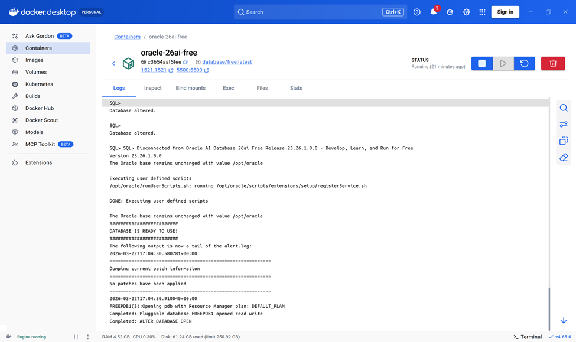
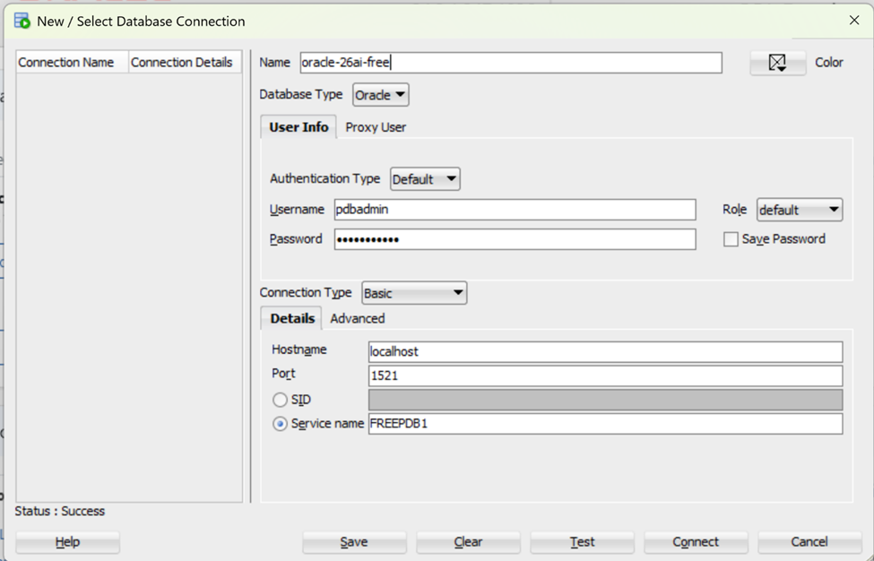

> **A practical local setup for validating Oracle AI code, testing vector-search workflows, and building a repeatable 26ai experimentation environment.**

Setting up a local Oracle Database 26ai Free environment is one of the most practical ways to start experimenting seriously with the new AI-related capabilities of the database without waiting for access to a larger managed environment.

While working on chapters for my new co-authored Packt book on Oracle AI, I needed a repeatable setup to validate code, test ideas, and refine examples before they made their way into the manuscript. A local Docker-based lab turned out to be the simplest and most effective answer. It gave me a controlled environment for testing AI Vector Search, ONNX model loading, SQL-based embeddings, and early database-side RAG experiments without introducing unnecessary operational overhead.

This article documents the setup I used on Windows. The goal is not to build a production deployment. The goal is to create a lightweight and reusable local lab that becomes part of your daily experimentation workflow.

## Why this local lab matters

A local Oracle Database 26ai Free lab is useful because it removes friction.

Instead of depending on a remote environment every time you want to test a query, validate a notebook integration, or try a new vector-search pattern, you can work locally with a disposable but persistent setup. In my case, this was especially useful during writing and validation work, where I needed to repeatedly test snippets and small workflow variations.

For practitioners working through the new Oracle AI capabilities, this kind of setup is valuable for at least three reasons:

- it is fast to rebuild
- it is cheap to run
- it creates a stable sandbox for experimentation before moving to a more formal environment

## The setup I used

The environment was intentionally simple:

- Windows as the host machine
- Docker to run Oracle Database 26ai Free locally
- SQL Developer for database-side work
- VS Code for Python and notebook-based integration where needed

That combination is more than enough for a serious local lab.

## Step 1: Pull the Oracle Database 26ai Free image

Start by pulling the Oracle Database Free image from Oracle Container Registry:

```bash
docker pull container-registry.oracle.com/database/free:latest
```

This gives you the local image you need to build the environment and serves as the base for the rest of the setup.

## Step 2: Start the container with persistence

Once the image is available locally, start the container with the database ports exposed and a local folder mounted for persistence.

On Windows, I used this pattern:

```bash
docker run -d ^
  --name oracle-26ai-free ^
  -p 1521:1521 ^
  -p 5500:5500 ^
  -e ORACLE_PWD=password123 ^
  -v "%cd%:/opt/oracle/oradata" ^
  container-registry.oracle.com/database/free:latest
```

A few details matter here:

- `1521` is the main database listener port
- `5500` can be useful for additional management access
- `ORACLE_PWD` sets the database password during initialization
- the volume mount to `/opt/oracle/oradata` preserves the database files across container restarts

That persistence is not a minor detail. It is what makes the setup genuinely usable for ongoing work. Without it, each rebuild becomes much less attractive because you lose your database state and have to recreate the environment from scratch.

## Step 3: Verify that the database is healthy

After starting the container, do not rush directly into client tools. First make sure the database is fully initialized.

A quick first check is:

```bash
docker ps
```

That confirms the container is up, but for Oracle Database startup, that alone is not enough. It is also worth checking the logs either from Docker Desktop or directly from the command line:

```bash
docker logs -f oracle-26ai-free
```

In my setup, I used Docker Desktop logs as a quick visual confirmation that the container was not only running, but that the Oracle database inside it had fully initialized and was ready for connections.



## Step 4: Test connectivity from inside the container

Before connecting from external tools, validate the database from inside the container with `sqlplus`:

```bash
docker exec -it oracle-26ai-free sqlplus pdbadmin/password123@FREEPDB1
```

Once connected, a simple query such as:

```sql
SELECT 1 FROM dual;
```

is enough to confirm that the session is alive and the service is reachable. This is a small step, but it helps separate database startup issues from client-side connection issues.

## Step 5: Connect from SQL Developer

Once the internal validation works, connect from SQL Developer using:

- **User:** `pdbadmin`
- **Password:** `password123`
- **Host:** `localhost`
- **Port:** `1521`
- **Service name:** `FREEPDB1`

This is the point where the setup stops feeling like “just a container” and starts becoming a normal working Oracle environment. From here, you can write SQL, test vector-related features, load models, and start building real local experiments.




## What this setup is good for

This local lab is especially useful for:

- validating Oracle Database 26ai code snippets
- testing AI Vector Search workflows
- experimenting with ONNX model loading
- trying SQL-based embeddings
- preparing notebook or Python integration experiments
- building the base environment for later RAG-style database experiments

In other words, it is not just a setup tutorial. It is the starting point for a whole series of practical 26ai experiments.

## A few practical notes

Even in a lightweight local setup, a few habits are worth keeping:

- use persistence from the beginning
- verify logs before assuming the database is ready
- test internal connectivity before debugging client tools
- keep the environment simple in the first iteration

For a local lab, simplicity is a feature. The point is not to simulate every production concern at once. The point is to create a stable sandbox you will actually use.

## Conclusion

This Oracle Database 26ai Free setup on Docker proved to be a very practical local lab: lightweight, repeatable, and no-cost. It gave me a solid foundation for validating code, testing ideas, and working hands-on with Oracle’s evolving AI-related features in a controlled environment.

With that foundation in place, the next logical step is to move beyond setup and into actual experimentation. In the next article in this series, I will build on this lab to explore embeddings and semantic similarity search in Oracle Database 26ai.
