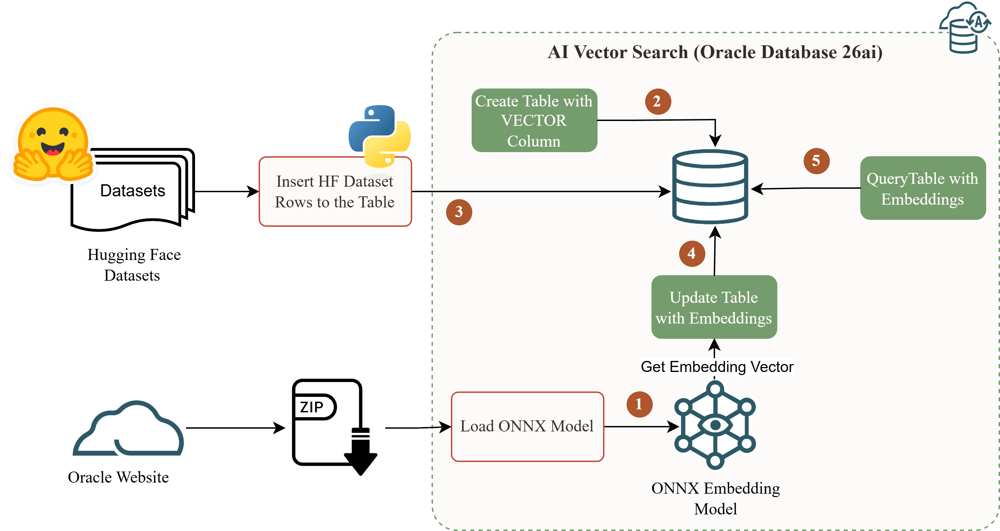
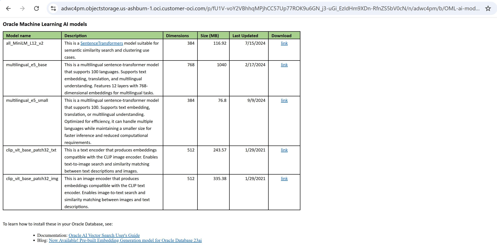
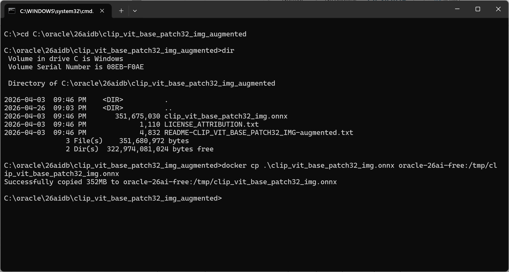

## The problem this solves

[The first post in this series](https://assoudi.blog/posts/building-local-oracle-database-26ai-free-lab/) was about getting Oracle Database 26ai Free running locally in Docker, removing the environment friction so the actual experimentation could begin. Once the lab was up, the first experiment I wanted to build was a car insurance claims PoC: given a damaged vehicle, find the most similar past claims based on both the image of the damage and its text description. A semantic search problem, image and text, inside Oracle.

Oracle 26ai has the tools for exactly this. Pre-built ONNX models load directly into the database. `VECTOR_EMBEDDING()` turns them into SQL functions. `VECTOR_DISTANCE()` handles the retrieval. Before any of that could be tested, I needed a table with real content, damaged car images, damage descriptions, enough variety across damage types to produce meaningful similarity results. Not five manually typed rows.

I started the way most people start: scraping. I pulled images from public sources, wrote damage descriptions by hand, built insert scripts, iterated on the schema. Two hours in, I had around thirty rows, inconsistent labeling, and growing doubt that the data was representative enough to validate anything about semantic search quality. The curation was the bottleneck, not the Oracle side.

That is when I switched to HuggingFace.

> **After following this guide, you will have a 150-row Oracle table with real car damage images and 512-dim CLIP embeddings, fully queryable by image similarity using `VECTOR_DISTANCE()`, with the foundation in place for the text similarity experiment that follows in the next post.**

---

## Why HuggingFace, and why it worked here

I know HuggingFace well. I have used it as a dataset and model source for years, contributed to several open repositories, and covered it in depth in my previous book, *Natural Language Processing on Oracle Cloud Infrastructure* (Apress, 2024). What I was looking for in this case was not a large-scale production dataset but something specific: structured, open, small enough for a local Docker experiment, and rich enough in both image and text modalities to make semantic similarity interesting.

`tahaman/DamageCarDataset` fit. 150 rows. Parquet format. Four damage classes, scratch, dent, tire flat, glass shatter. One `BLOB`-ready image and one natural-language damage description per row. Available in train and test splits. The kind of dataset you would spend three days building manually and never quite get right.

The more important point is what using it changed. Instead of investing time in data curation, I invested it in Oracle, model selection, vectorization behavior, retrieval quality, SQL patterns. That is where the learning is. The dataset was a means, not the subject.

This is not a production ingestion pattern. HuggingFace is not a replacement for enterprise data pipelines. What it is, for this purpose, is an experiment accelerator: a fast path to usable, structured data so the Oracle AI work can start.

---

## Who this is for

This post is for **Oracle developers and data engineers** who:

- Have a local Oracle 26ai lab running in Docker, [post #1 in this series](https://assoudi.blog/posts/building-local-oracle-database-26ai-free-lab/) covers that setup
- Want to test Oracle's vector search capabilities, including pre-built ONNX models, without spending time building throwaway test data
- Are interested in multimodal experiments, image and text similarity in the same table

It is **not** for teams building production data pipelines or working with proprietary data that cannot be staged locally.

---

## The approach

The pattern here separates two concerns that usually slow each other down: data sourcing and Oracle AI work. HuggingFace handles the first. Oracle handles the second.

On the data side: the `datasets` Python library downloads `tahaman/DamageCarDataset` in one call, structured Parquet with images, labels, and text descriptions, and inserts all 150 rows into Oracle in a single `executemany`. No schema negotiation, no file management, no insert-script iteration.

On the Oracle side: `DBMS_VECTOR.LOAD_ONNX_MODEL` registers Oracle's pre-built CLIP image encoder as a SQL function. A single `UPDATE` with `VECTOR_EMBEDDING()` processes all 150 images and writes the 512-dim vectors directly into the table. No Python loop, no external API call, no round-trip per row.

The result is a working vector search experiment in one session. The same table, with its text descriptions intact, is also the starting point for the text embedding experiment in the next post.

### Architecture


*The ONNX model and the data live in the same Oracle engine. Embedding generation is a SQL function call, not an external process.*

**What lives inside Oracle:**
- `damage_car_table` with a `VECTOR(512, FLOAT32)` column
- `CLIP_VIT_BASE_PATCH32_IMG` ONNX model, registered via `DBMS_VECTOR`
- `VECTOR_EMBEDDING()` and `VECTOR_DISTANCE()` available as native SQL functions

**What stays outside Oracle:**
- One-time HuggingFace dataset download (Python, `datasets` library)
- One-time CLIP `.onnx` file download from Oracle's model catalog
- `docker cp` to place the model file where Oracle can read it

---

## Prerequisites

| Requirement | Details |
|---|---|
| Oracle version | Oracle Database 26ai Free, running in Docker |
| Lab setup | [Post #1 in this series](https://assoudi.blog/posts/building-local-oracle-database-26ai-free-lab/) |
| Oracle features | `DBMS_VECTOR`, `VECTOR` column type, `VECTOR_EMBEDDING()`, `VECTOR_DISTANCE()` |
| Python | 3.10+, install dependencies with `pip install oracledb datasets pillow` |
| Model file | `clip_vit_base_patch32_img.onnx` from Oracle's ONNX model catalog, see Step 2 |
| Estimated time | 20–30 minutes, excluding model download |

**Assumed knowledge:** Connecting to an Oracle PDB with sqlplus or SQL Developer, and running Python scripts from the terminal.

---

## Step-by-step

> Full source: `clip_demo_setup.sql` · `clip_demo_import_dataset.py` · `clip_demo_vectorize.sql`

### Step 1, Create the database user and wire up the ONNX directory

`clip_demo_setup.sql` runs as SYS and does three things that all need to be present for the rest to work. It creates the `demo_vec` schema, grants `CREATE MINING MODEL`, a privilege that `DBMS_VECTOR.LOAD_ONNX_MODEL` requires and that is easy to miss, and creates the `ONNX_TMP` Oracle `DIRECTORY` object pointing to `/tmp` inside the container. That directory object is the bridge between the filesystem path where the ONNX file lands and the Oracle engine that reads it.

```sql
-- clip_demo_setup.sql, run as SYS against FREEPDB1
CREATE USER demo_vec IDENTIFIED BY demo_vec
  DEFAULT TABLESPACE USERS
  TEMPORARY TABLESPACE TEMP
  QUOTA UNLIMITED ON USERS;

GRANT CREATE SESSION, CREATE TABLE, CREATE SEQUENCE,
      CREATE VIEW, CREATE MINING MODEL TO demo_vec;
GRANT DB_DEVELOPER_ROLE TO demo_vec;

CREATE OR REPLACE DIRECTORY ONNX_TMP AS '/tmp';
GRANT READ, WRITE ON DIRECTORY ONNX_TMP TO demo_vec;
```

Run it against the container, passing the SYS password (retrieve it with `docker inspect oracle-26ai-free --format '{{range .Config.Env}}{{println .}}{{end}}' | grep ORACLE_PWD`):

```bash
docker exec -i oracle-26ai-free \
  sqlplus sys/<SYS_PASSWORD>@//localhost/FREEPDB1 as sysdba \
  < clip_demo_setup.sql
```

**What can go wrong here:** `DIRECTORY` objects require `CREATE ANY DIRECTORY` and must be created as SYS, not as `demo_vec`. If you run the script under the wrong user, the directory creation fails silently and `LOAD_ONNX_MODEL` will later report a misleading `ORA-29283` file-not-found error.

---

### Step 2, Get the Oracle CLIP ONNX model into the container

Oracle publishes a catalog of pre-built, database-validated ONNX models on OCI Object Storage. The key word is *validated*: these models carry Oracle-specific metadata that maps their input/output nodes to what `DBMS_VECTOR` expects. A vanilla HuggingFace ONNX export of the same CLIP model will load without error but produce wrong vectors at inference time. Use the catalog model.

Open the catalog in your browser and find **`clip_vit_base_patch32_img`**, the image encoder, 512 dimensions, ~335 MB:



Download `clip_vit_base_patch32_img_augmented.zip`. Unzip it. Inside you will find `clip_vit_base_patch32_img.onnx` alongside a license file and README. Copy the `.onnx` file into the container:

```bash
cd C:\oracle\26aidb\clip_vit_base_patch32_img_augmented

docker cp .\clip_vit_base_patch32_img.onnx ^
  oracle-26ai-free:/tmp/clip_vit_base_patch32_img.onnx
```

A successful copy prints: `Successfully copied 352MB to oracle-26ai-free:/tmp/clip_vit_base_patch32_img.onnx`



**What can go wrong here:** The catalog URL occasionally changes when Oracle publishes updated model versions. If the link is stale, search "Oracle Machine Learning AI models OCI Object Storage" to find the current catalog page.

---

### Step 3, Create the table and import the dataset

`clip_demo_vectorize.sql` defines the table with `VECTOR(512, FLOAT32)`, the dimension must match the CLIP model output exactly or `VECTOR_EMBEDDING()` will reject the update later. Run step 1.1 from that file first:

```sql
-- clip_demo_vectorize.sql, step 1.1
DROP TABLE damage_car_table PURGE;

CREATE TABLE damage_car_table (
   id          NUMBER GENERATED ALWAYS AS IDENTITY PRIMARY KEY,
   image_id    NUMBER,
   label       VARCHAR2(100),
   image       BLOB,
   description CLOB,
   embedding   VECTOR(512, FLOAT32)
);
```

Then run `clip_demo_import_dataset.py`. It calls `load_dataset("tahaman/DamageCarDataset")`, iterates over both splits (125 train + 25 test), converts each PIL image to bytes, and inserts all 150 rows in a single `executemany` call. The `embedding` column is left `NULL` at this stage.

```python
# clip_demo_import_dataset.py, core logic (simplified)
ds = load_dataset("tahaman/DamageCarDataset")
batch = [
    {"image_id": r["image_id"], "label": r["label"],
     "image":    image_to_bytes(r["image"]),
     "description": r["description"]}
    for split in ds.values() for r in split
]
cur.executemany(INSERT_SQL, batch)
conn.commit()
```

Verify with step 1.3 from the SQL file:

```sql
SELECT COUNT(1) FROM damage_car_table;   -- expected: 150
```

**What can go wrong here:** `python-oracledb` thin mode connects without an Oracle Client install, but the package must be installed in the same Python interpreter that runs the script. If `import oracledb` fails, confirm with `python -m pip show oracledb`, the `python` here must be the same executable.

---

### Step 4, Load the CLIP model and generate all embeddings

`DBMS_VECTOR.LOAD_ONNX_MODEL` reads `clip_vit_base_patch32_img.onnx` from the `ONNX_TMP` directory and registers it as `CLIP_VIT_BASE_PATCH32_IMG` inside Oracle. This is a one-time operation, the model persists across sessions and is immediately available as a SQL function.

```sql
-- clip_demo_vectorize.sql, step 2.1
BEGIN
  DBMS_VECTOR.LOAD_ONNX_MODEL(
    DIRECTORY  => 'ONNX_TMP',
    FILE_NAME  => 'clip_vit_base_patch32_img.onnx',
    MODEL_NAME => 'CLIP_VIT_BASE_PATCH32_IMG',
    METADATA   => JSON('{"function":"embedding","embeddingOutput":"embedding",
                         "input":{"input":["DATA"]}}')
  );
END;
/
```

Verify the model registered (step 2.2):

```sql
SELECT model_name, algorithm, mining_function FROM user_mining_models
 WHERE model_name = 'CLIP_VIT_BASE_PATCH32_IMG';
```

Then generate all 150 embeddings in one pass (step 3.1):

```sql
UPDATE damage_car_table
   SET embedding = VECTOR_EMBEDDING(CLIP_VIT_BASE_PATCH32_IMG USING image AS DATA);
COMMIT;
```

And run your first similarity query (step 3.3), the three images most similar to row `id = 1`:

```sql
SELECT t2.image_id, t2.label, t2.description,
       VECTOR_DISTANCE(t2.embedding, t1.embedding) AS distance
FROM   damage_car_table t1
JOIN   damage_car_table t2 ON t2.id <> t1.id
WHERE  t1.id = 1
ORDER  BY distance
FETCH FIRST 3 ROWS ONLY;
```

**What can go wrong here:** If `LOAD_ONNX_MODEL` returns `ORA-29283`, the `.onnx` file is not readable from inside the container. Confirm with `docker exec oracle-26ai-free ls -lh /tmp/clip_vit_base_patch32_img.onnx` before retrying. If you need to reload the model after a prior failed attempt, drop it first with `DBMS_VECTOR.DROP_ONNX_MODEL(MODEL_NAME => 'CLIP_VIT_BASE_PATCH32_IMG')`.

---

## What I observed

**The data preparation that used to take hours took minutes.** The scraping attempt I started with produced thirty inconsistent rows in two hours. `load_dataset("tahaman/DamageCarDataset")` and `executemany` produced 150 clean, structured rows in under two minutes. That is not a marginal improvement, it changed how the rest of the session felt. The Oracle-side work started immediately.

**The dual modality of `DamageCarDataset` paid off more than expected.** Every row has both a `BLOB` image and a natural-language damage description. That means the same table supports an image similarity experiment now and a text similarity experiment in the next post, without any additional data preparation. Datasets with that combination are harder to assemble manually than they are to find on HuggingFace, that is the argument for open datasets as an experimentation source in one concrete example.

**Using the Oracle catalog model is not optional, it is the difference between correct and incorrect results.** I tested this. Exporting `openai/clip-vit-base-patch32` with `optimum-cli` and loading the resulting file produces a model that registers and runs without errors. The vectors it generates are wrong. The Oracle catalog file carries metadata that maps the ONNX graph's input/output nodes to what `DBMS_VECTOR` expects. That metadata is not in a vanilla HuggingFace export. The fix is simple, use the catalog, but the failure mode is subtle enough to waste significant time.

**`VECTOR_EMBEDDING()` inside a bulk `UPDATE` is the cleanest embedding pattern I have used.** No batch loop, no serialization, no Python process to manage. The model runs inside Oracle, processes all 150 rows in one pass, and writes vectors in place. At 150 rows this is instant; the pattern holds at larger scale with a vector index in place.

---

## Limits and trade-offs

| Dimension | This approach | The alternative |
|---|---|---|
| Data setup time | Minutes, one `load_dataset` call | Hours, manual collection, curation, insert scripts |
| Data control | Limited to what HuggingFace provides publicly | Full control, any source, any schema |
| Embedding pipeline complexity | None, `VECTOR_EMBEDDING()` is a SQL function | Moderate, external process, batch management, retry logic |
| Model flexibility | Limited to Oracle's ONNX catalog | Any model accessible from Python |
| Scale readiness | Works to ~100K rows without a vector index | Needs `HNSW` index and partitioning for production volume |
| Portability | Tied to Oracle 26ai's `DBMS_VECTOR` | Python-based pipelines are more portable across databases |

**What this approach does not solve:**

- Proprietary or sensitive data that cannot be staged in a local Docker container
- Production ingestion requirements, this is an experiment accelerator, not a data pipeline
- Custom or fine-tuned models outside Oracle's ONNX catalog
- Real-time embedding of new rows as they arrive, the bulk `UPDATE` pattern is a batch operation

---

## When to use this, and when not to

| Your situation | Use this? | Why |
|---|---|---|
| Starting a new vector search experiment and need data fast | ✅ Yes | Fastest path from zero to queryable vectors, no data engineering work |
| Building a reproducible tutorial, demo, or blog series | ✅ Yes | Public dataset means anyone following along starts from an identical state |
| Validating Oracle 26ai's vector search capabilities before committing to production data prep | ✅ Yes | Self-contained, nothing external to configure or maintain |
| Your data is proprietary or cannot leave your local environment | ❌ No | HuggingFace requires internet access; use internal datasets with the same Oracle-side steps |
| You need a model not available in Oracle's ONNX catalog | ❌ No | The catalog metadata wrapper is required; unmodified HuggingFace ONNX exports are not reliable here |
| Building a production system with millions of rows | ⚠️ Partial | The vectorization pattern holds; add a `HNSW` vector index and revisit the data source |

---

## Final take

The post-lab bottleneck in Oracle AI experimentation is almost always data, not the ONNX model, not the SQL syntax, not the `VECTOR` column. The scraping attempt I started with was the right instinct but the wrong tool. HuggingFace datasets are the right tool for this stage because they remove repetitive, low-value setup work and let the experiment start. Once `damage_car_table` had 150 real images and 512-dim CLIP vectors in it, everything that mattered, retrieval quality, distance behavior, semantic grouping across damage types, was immediately testable.

The in-database ONNX pattern deserves its own attention. The idea that an ONNX model loads once into Oracle, becomes a SQL function, and runs across an entire table in a single `UPDATE` is not how most practitioners expect embedding generation to work. It is a meaningful reduction in moving parts, and it is what makes the Oracle-native experiment loop fast enough to be worth repeating.

> **A public dataset that takes two minutes to load is worth more to an experiment than a custom dataset that takes two days to build, as long as it is representative enough for the questions you are actually trying to answer.**

---

## Related assets

| Asset | Link |
|---|---|
| `clip_demo_setup.sql` | DB user, grants, and ONNX directory setup |
| `clip_demo_import_dataset.py` | HuggingFace dataset download and Oracle batch insert |
| `clip_demo_vectorize.sql` | Table DDL, model load, embedding generation, similarity queries |
| Oracle ML AI Models catalog | [OCI Object Storage model catalog](https://adwc4pm.objectstorage.us-ashburn-1.oci.customer-oci.com/p/fU1V-voY2VBhhqMPjhCC57Up77ROK9u6GN_j3-uGi_EzIdHm9XDn-RfnZS5bV0cN/n/adwc4pm/b/OML-ai-models/o/Oracle%20Machine%20Learning%20AI%20models.htm) |
| *Natural Language Processing on Oracle Cloud Infrastructure* | Apress, 2024, covers HuggingFace datasets and model hub in depth |
| Series post #1 | [Building a Local Oracle 26ai Free Lab with Docker on Windows](https://assoudi.blog/posts/building-local-oracle-database-26ai-free-lab/) |

---

## Next in this series

> **`damage_car_table` now has 150 real car damage cases, images, labels, text descriptions, and CLIP image embeddings. The next post takes this table into the use case it was always meant for: an end-to-end car insurance claims PoC, using both image and text similarity to find related cases. That post will also cover where CLIP's embedding space breaks down for this domain, and what the published research says about why.**
